<h1 align="center">2020 Kaggle ML & DS Survey - EDA</h1>
For the fourth year, <a href="https://www.kaggle.com/">Kaggle</a> surveyed its community of data enthusiasts to share trends within a quickly growing field. In this project, I made a few charts that represent the most important data from the survey. It's my first EDA, so it has been made for educational purposes. In addition to the charts, I made a simple Dash visualization that allows the users to filter the data by country and job title.

## 📄 Data
<a href="https://github.com/martinnyakimov/Kaggle-survey-EDA/blob/main/kaggle_survey_2020_responses.csv">kaggle_survey_2020_responses.csv</a>: 39+ questions and 20,036 responses

## ⚙️ Technologies used
* <a href="https://www.python.org/">Python</a>
* <a href="https://pandas.pydata.org/">Pandas</a>
* <a href="https://numpy.org/">NumPy</a>
* <a href="https://plotly.com/python/plotly-express/">Plotly Express</a>
* <a href="https://plotly.com/dash/">Dash</a>

## 💻 Demo ()
<pre>In order to see the result of the last cell (Dash), please sign in to your Google account and run all cells.</pre>

## 📊 Visualization
<table border="0">
  <tr>
    <td>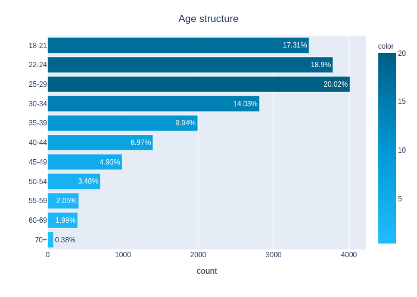</td>
    <td>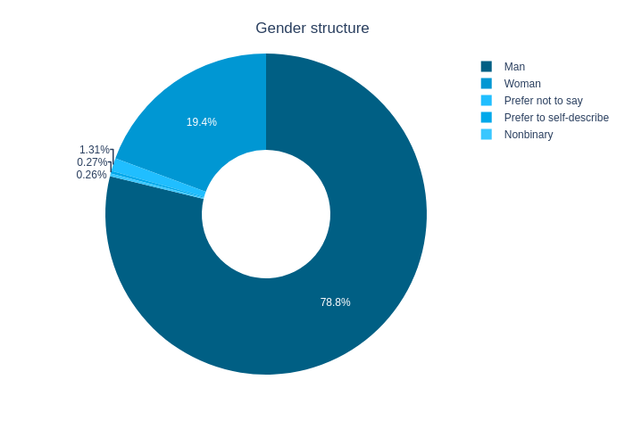</td>
  </tr>
  <tr>
    <td>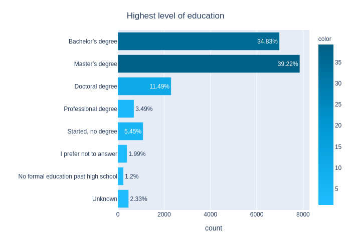</td>
    <td>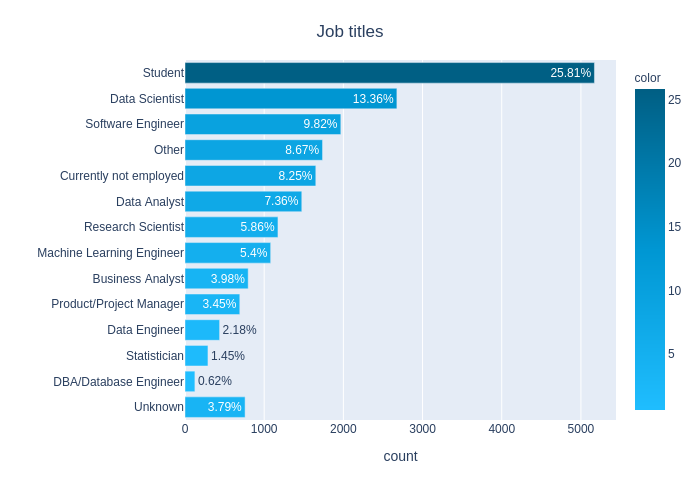</td>
  </tr>
  <tr>
    <td>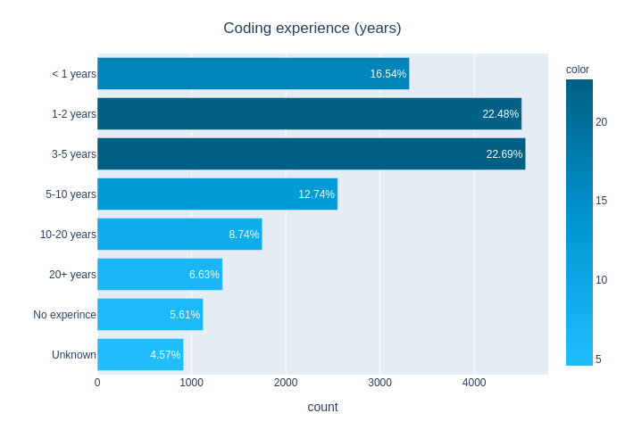</td>
    <td>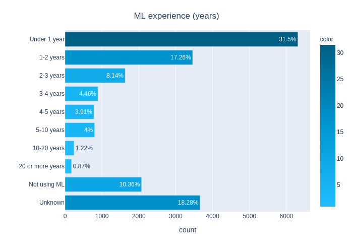</td>
  </tr>
  <tr>
    <td>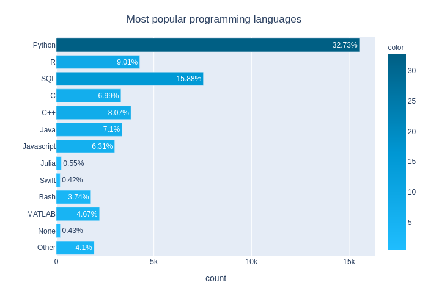</td>
    <td>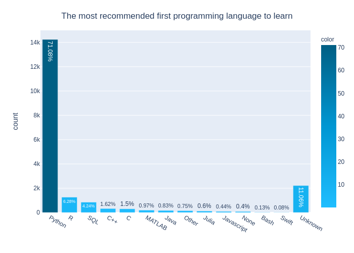</td>
  </tr>
  <tr>
    <td>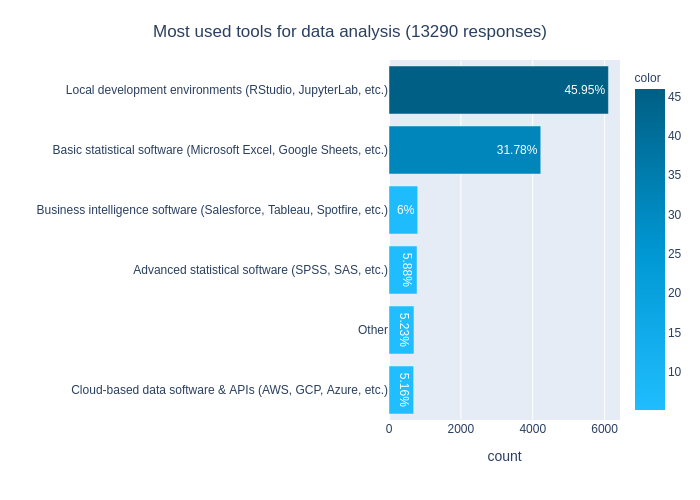</td>
    <td>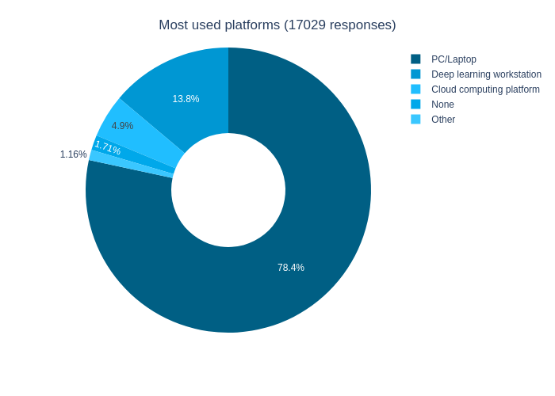</td>
  </tr>
</table>

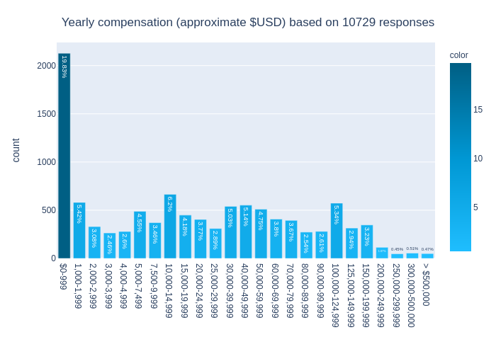

